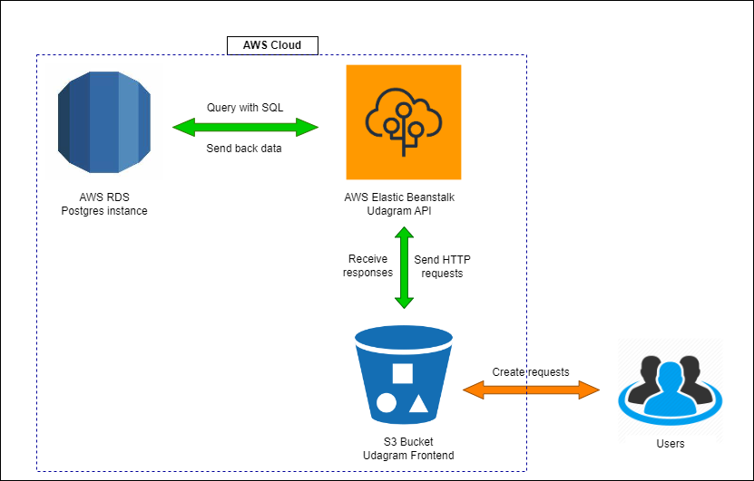

# Udagram Infrasctructure Description

## AWS

### RDS - Postgres

- Endpoint: udagramdb-1.cxzlechiigbp.us-east-1.rds.amazonaws.com
- Port: 5432

### Elastic Beanstack

- Endpoint: http://udacity-api-env.eba-my8pyh2t.us-east-1.elasticbeanstalk.com/

### S3 Bucket

- Endpoint: http://udagrams3-903752074010.s3-website-us-east-1.amazonaws.com/
