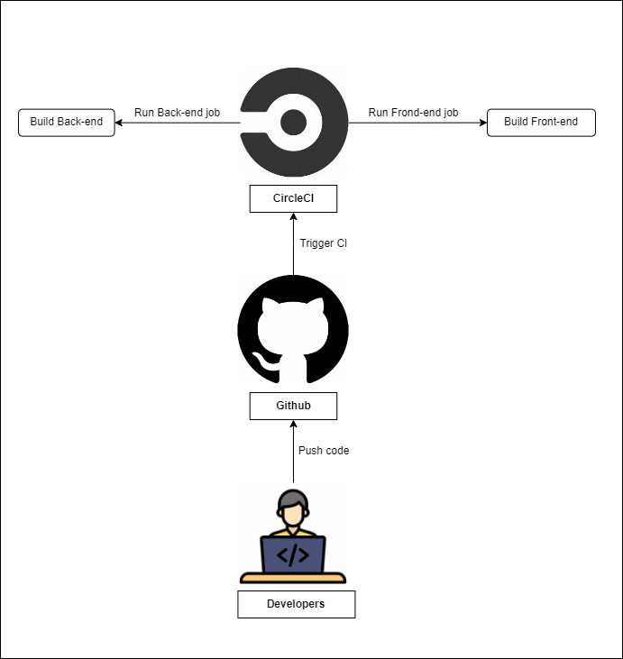

# Pipeline Process Description



## 1. Set up CircleCI and connect to GitHub

1. **Step 1** Create a pipeline file in the **.circleci** folder and name it **config.yml**.
2. **Step 2** Create a new repository on GitHub and push the project to that repository.
3. **Step 3** Sign up for a [free account](https://circleci.com/signup/?source-button=free) on CircleCI using your GitHub credentials.
4. **Step 4** Set up a new project in the CircleCI dashboard using the GitHub repository you just created. Select the existing **.circleci/config.yml** file in the repository.
5. **Step 5** Trigger pipeline run in the CircleCI UI by committing and pushing a new change to the repository.

## 2. Continuous Integration Instruction

1. **Update the root package.json file.**
2. **Update the config.yml:**
3. **Trigger:** Push the changes to the GitHub repo. After pushing this change to our GitHub repo, CircleCI will trigger, and we will complete the continuous integration step.

## 3. Continuous Delivery and Deployment Instruction

1. **Update the S3 bucket name:** In the frontend folder, edit the **.../bin/deploy.sh script** and add the name of the previously used S3 bucket.
   ```typescript
   # Replace [udagram-s3] with the S3 bucket name
   aws s3 cp --recursive --acl public-read ./build s3://[udagram-s3]/
   ```
2. **Update the frontend package.json** - Add a new "deploy" like this:
   ```typescript
   "scripts": {
       "start": "react-scripts start",
       "build": "react-scripts build",
       "deploy": "chmod +x bin/deploy.sh && bin/deploy.sh"
   }
   ```
3. **Update the root-level package.json** - Add a command "frontend:deploy" to the root-level package.json as:
   ```typescript
   "scripts": {
       ...,
       "frontend:deploy": "cd rudagram/udagram-frontend  && npm run deploy"
   }
   ```
4. **Modify the .circleci/config.yml**:
   - Update the orb section:
     ```typescript
     orbs:
     node: circleci/node@5.0.2
     eb: circleci/aws-elastic-beanstalk@2.0.1
     aws-cli: circleci/aws-cli@3.1.1
     ```
   - Add the aws-cli/setup step just after the checkout step. This will install and configure the AWS CLI on the CircleCI server.
   - Add the last step for deployment:
     ```typescript
     - run:
         name: Deploy App
         command: |
             npm run frontend:deploy
     ```
   - Update workflows in the **config.yml** file:
     ```typescript
     workflows:
         udagram:
             jobs:
                 - build:
                     filters:
                         branches:
                             only:
                                 - main
                 - deploy:
                     requires:
                         - build
     ```
5. **Update environment variables** - Add values for _AWS_ACCESS_KEY_ID, AWS_SECRET_ACCESS_KEY, and AWS_DEFAULT_REGION_ on CircleCI dashboard.
   **Trigger** - Push the local changes to GitHub, then the CircleCI build will trigger and execute all the steps mentioned in the config.yml file.
